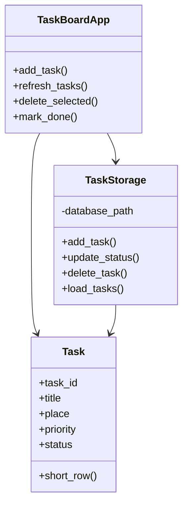

# Архитектура TaskBoardLite

Проект разделен на три основных слоя.

```mermaid
classDiagram
    class TaskBoardApp {
        +add_task()
        +refresh_tasks()
        +delete_selected()
        +mark_done()
    }

    class Task {
        +task_id
        +title
        +place
        +priority
        +status
        +short_row()
    }

    class TaskStorage {
        -database_path
        +add_task()
        +update_status()
        +delete_task()
        +load_tasks()
    }

    TaskBoardApp --> Task
    TaskBoardApp --> TaskStorage
    TaskStorage --> Task
```

`TaskBoardApp` отвечает за интерфейс, `Task` описывает заявку, а
`TaskStorage` работает с SQLite.
